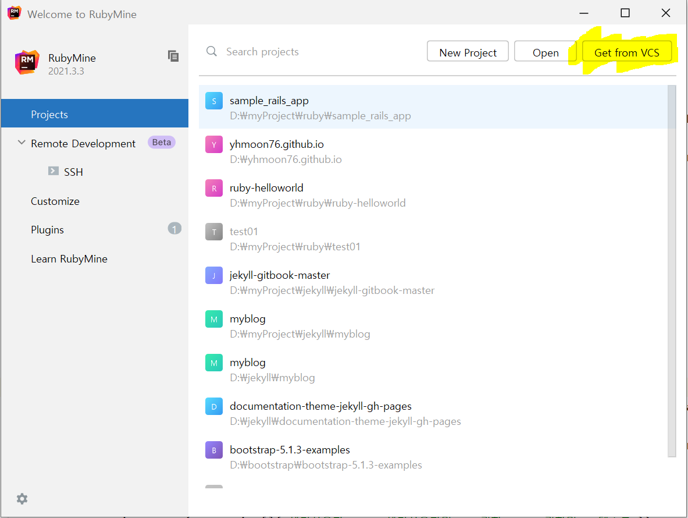
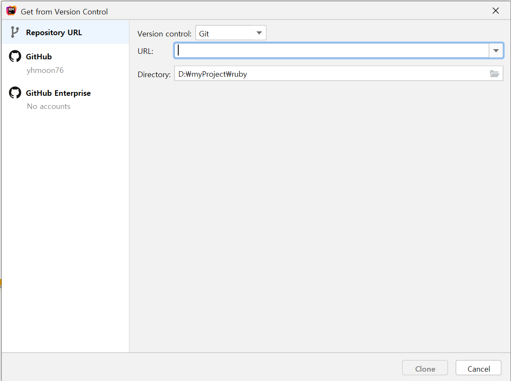

[1]:https://nodejs.org/en/download/

[node.js (node-v16.14.2-x64.msi) 다운로드][1] 설치

npm (Node Package Manager) 노드 패키지 관리자 Node.js에서 사용하는 모듈들을 패키지로 만들어 통합 관리/배포

버전 확인  
```shell
C:\Users\yhmoo>node -v
v16.14.2

C:\Users\yhmoo>npm -v
8.5.0
```

### <span style="color:#6a9fb5">Yarn 설치</span>
```shell
C:\Users\yhmoo>npm install --global yarn

added 1 package, and audited 2 packages in 2s

found 0 vulnerabilities
npm notice
npm notice New minor version of npm available! 8.5.0 -> 8.6.0
npm notice Changelog: https://github.com/npm/cli/releases/tag/v8.6.0
npm notice Run npm install -g npm@8.6.0 to update!
npm notice

C:\Users\yhmoo>yarn --version
1.22.18
```

### <span style="color:#6a9fb5">JetBrains sample 설정</span>

git 으로 RubyMine 설정을 한다.
git 으로 설정시 version control 설정이 File > New > Project.. 에 없어서 모든 프로젝트를 close 하면  
아래와 같이 git 으로 프로젝트를 설정할수 있다.



Get form VCS 버튼을 클릭 하면 아래와 같이 git url 입력하는 화면이 노출 되며  
Version control : Git 선택후  
Url : https://github.com/JetBrains/sample_rails_app.git 입력하면 된다.



Ctrl 키 두번 누르면 Run Anything 창이 열린다. 그런 아래와 같이 입력해서 실행한다.

bundle install

번들 설치 대화 상자 에서 다음 인수를 추가  
--without production    
